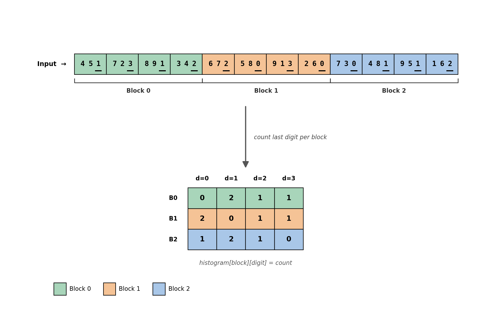
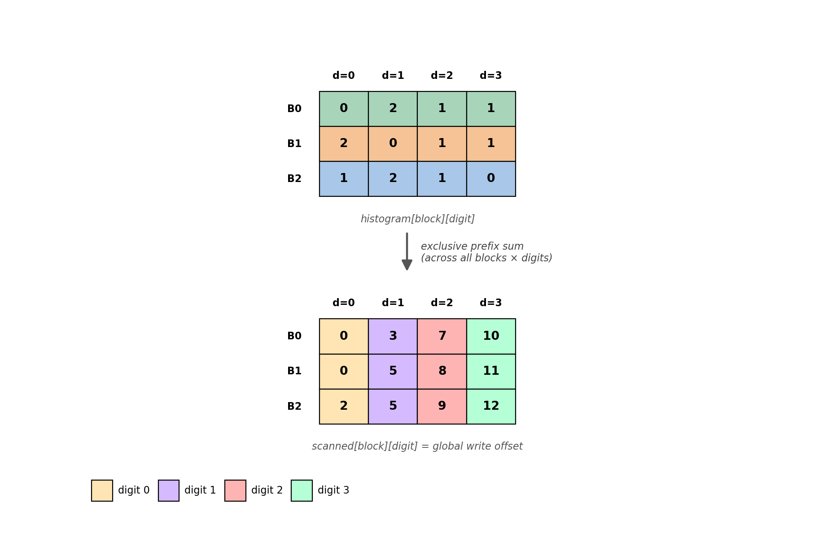
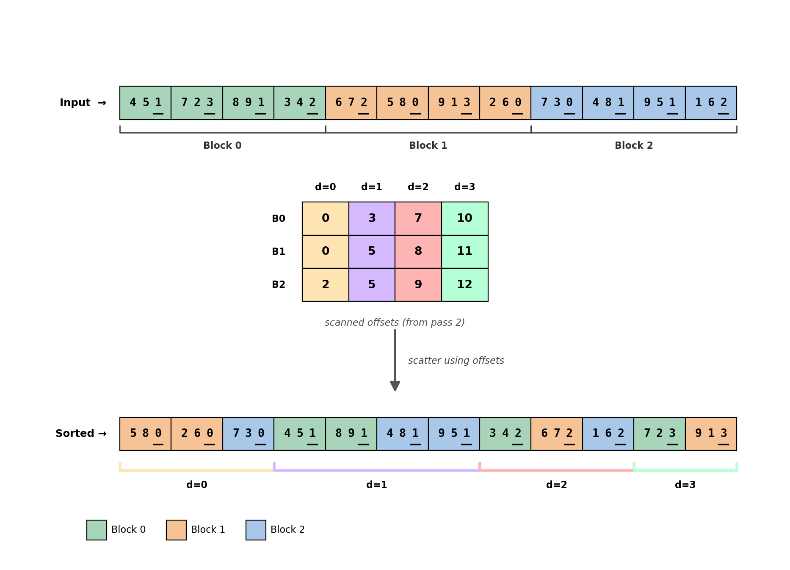
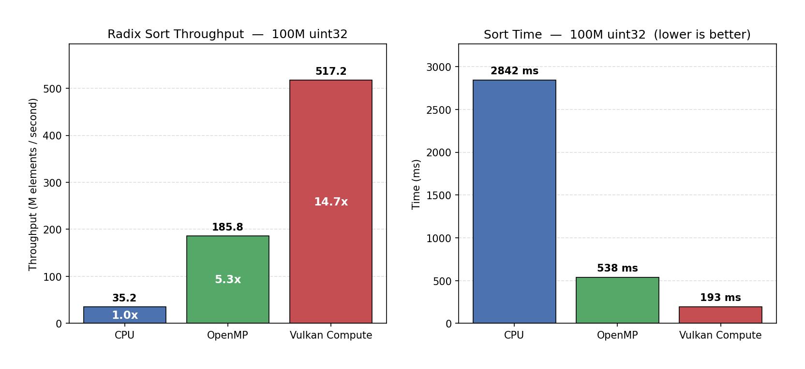

# vkRadix

GPU radix sort using Vulkan compute shaders.

Sorts arrays of `uint32_t` using base-256 LSB radix sort: 4 passes over the bytes of the key, each pass histogram → prefix scan → stable scatter, ping-ponging between two device-local buffers.

## Building

Requires the Vulkan SDK, CMake 3.16+, OpenMP, and a C++17 compiler.

```bash
./compile_shaders.sh
cmake -B build -DCMAKE_BUILD_TYPE=Release
cmake --build build --parallel
./build/Release/RadixSort
```

The benchmark scans `assets/test/` for `.bin` files (raw `uint32_t` arrays — generate with `scripts/gen_data.py`) and prompts you to pick a file and an algorithm.

## Algorithm

A pass over one byte of the key has three GPU dispatches: **histogram → scan → scatter**. The toy example diagrams below use 12 elements split into 3 blocks of 4, with radix = 4. The real implementation uses 16384 elements per block and radix 256.

### Pass 1 — Histogram

One workgroup per block (16384 elements). The 256 threads in the workgroup cooperate to count digit occurrences using shared-memory atomics:

```glsl
shared uint localHist[256];
localHist[tid] = 0;
barrier();
for (uint i = lo + tid; i < hi; i += 256) {
    atomicAdd(localHist[(src[i] >> shift) & 0xFF], 1);
}
barrier();
hist[blockIdx * 256 + tid] = localHist[tid];   // one entry per thread
```

The result is a `numBlocks × 256` matrix in global memory. Strided access (`i += 256`) keeps reads coalesced.

<p align="center">
  
</p>

### Pass 2 — Scan

A single workgroup of 256 threads turns the histogram into per-block, per-digit **global write offsets**. Each cell `scanned[B][d]` becomes the position in the output where block `B` should start writing its elements with digit `d`.

The scan happens in three phases:

1. **Per-column scan**: thread `d` does an exclusive prefix sum down its digit column and records the column total.
2. **Cross-column prefix**: thread 0 does an exclusive prefix sum over the 256 column totals.
3. **Apply column base**: each cell adds its column's base offset.

After the scan, digit-0 elements occupy positions `[0, count(d=0))`, digit-1 elements occupy `[count(d=0), count(d=0) + count(d=1))`, etc. — and within each digit, blocks appear in order.

<p align="center">
  
</p>

### Pass 3 — Scatter

Each workgroup loads its row of offsets into shared memory, then **thread 0** sequentially scatters the block's elements:

```glsl
if (tid == 0) {
    for (uint i = lo; i < hi; ++i) {
        uint v = src[i];
        uint d = (v >> shift) & 0xFF;
        dst[offsets[d]++] = v;
    }
}
```

Sequential placement within the block guarantees **stability** — elements with the same digit retain their input order, which is essential for LSB radix sort to produce a correct global sort across passes.

The thread-0 serial scatter is currently the main parallelism bottleneck. It can be parallelized with subgroup-ballot match scans (using `subgroupBallot` / `subgroupBallotExclusiveBitCount`) — each subgroup of 32 threads scatters 32 elements in parallel while preserving stability.

<p align="center">
  
</p>

## Ping-pong

After 4 passes, the data is back in the user-supplied input buffer (4 swaps = even). No final copy is needed.

| Pass | reads from   | writes to    |
|------|--------------|--------------|
| 0    | inputBuffer  | scratchBuf   |
| 1    | scratchBuf   | inputBuffer  |
| 2    | inputBuffer  | scratchBuf   |
| 3    | scratchBuf   | inputBuffer  |

## Benchmark results

100M `uint32_t` elements, uniform distribution:

<p align="center">
  
</p>

| Algorithm                    | Hardware                        | Time      | Throughput     | Speedup vs CPU |
|------------------------------|---------------------------------|-----------|----------------|----------------|
| CPU (single thread)          | Intel Core i7-12700K            | 2842 ms   | 35.2 M elem/s  | 1.0×           |
| OpenMP (20 threads)          | Intel Core i7-12700K            | 538 ms    | 185.8 M elem/s | 5.3×           |
| Vulkan Compute               | NVIDIA GeForce RTX 3060         | 193 ms    | 517.2 M elem/s | 14.7×          |

## Usage

`RadixSort` is invoked by recording into an existing command buffer:

```cpp
RadixSort sorter(ctx, maxElements);          // pre-allocates scratch + histogram
sorter.recordSort(cmd, inputBuffer, count);  // 4 passes, 12 dispatches total
// after the command buffer is submitted, inputBuffer holds the sorted data
```

The input buffer must be created with `VK_BUFFER_USAGE_STORAGE_BUFFER_BIT` and large enough for `count` `uint32_t`s.